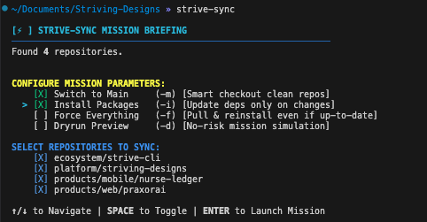
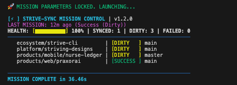

# 🚀 Strive-Sync (v1.3.0)

[](https://opensource.org/licenses/MIT)
[](https://github.com/prayasshr/strive-cli/releases)
[](https://strivingdesigns.com)

> [!IMPORTANT]
> **Project Status: Stable**
> This tool is part of the `strive-cli` suite.

**Strive-Sync** is a parallel Git synchronization tool for multi-repository environments. It reduces the steps for keeping dozens of repositories in sync to a single command.

If you work in a microservices architecture or a distributed workspace, `strive-sync` saves you from the manual `git pull` and `npm install` loop.





---

## ✨ Features

- 🏎️ **Parallel Execution**: Syncs all repositories concurrently.
- 🎛️ **Mission Control Dashboard**: Real-time visual tracking for sync status, dirty states, and updates.
- 🧠 **Smart Branch Detection**: Automatically detects each repo's default branch from its remote HEAD reference — no hardcoding of `main` or `master`.
- 📦 **Install Packages**: Use `--install` (`-i`) to update dependencies only when lockfiles change. Automatically honours `.nvmrc` and `.node-version` — `nvm use` is called before any install so the correct Node.js version is always active.
- 🛡️ **Mission Audit Trail**: Use `--audit` (`-a`) to generate a persistent `AUDIT.md` report of your sync mission, including specific decisions made for each repository (branch detected, node version used, etc).

- 🎯 **Pinpoint Controls**:
  - `--only <repo>`: Sync ONLY the specified repository.
  - `--branch <name>` (`-b`): Override the target branch for all repos.
  - `--main` (`-m`): **Switch to Main** branch if current branch is clean.
  - `--dry-run` (`-d`): **Dryrun Preview** mode to simulate changes.
  - `--install` (`-i`): **Install Packages** if lockfiles change.
  - `--force` (`-f`): **Force Everything** (Full pull and reinstall even if up-to-date).
- 🛡️ **Secure Architecture**: POSIX-compliant directory parsing, dynamic Git upstream tracking, and `mktemp`-based temp directories to prevent auth hangs.
- 🗂️ **Clean State Storage**: Persists mission memory to `$XDG_STATE_HOME/strive-sync/last_sync` (defaults to `~/.local/state/strive-sync/last_sync`), keeping your home directory clean.
- ⚙️ **Zero Config**: Runs out of the box — no configuration needed.

## 🚀 Usage

Navigate to any directory containing multiple Git repositories and run:

```bash
strive-sync
```

With dependency install enabled:

```bash
strive-sync --install
```

Force a full re-install of all deps:

```bash
strive-sync --force
```

### 🎛️ Options & Flags

| Flag | Short | Description |
| :--- | :--- | :--- |
| `--only <repo>` | `-o` | Sync ONLY the specified repository. |
| `--exclude <repo>` | `-e` | Skip a specific repository. |
| `--branch <name>` | `-b` | Override the target branch for all repos. |
| `--dry-run` | `-d` | Dryrun Preview: simulate changes without applying them. |
| `--install` | `-i` | Install Packages only if lockfiles change. |
| `--main` | `-m` | Switch to Main branch (if clean) before syncing. |
| `--force` | `-f` | Force Everything: pull and reinstall even if up-to-date. |
| `--audit` | `-a` | Generate AUDIT.md report of the mission. |
| `--parallel <num>` | `-p` | Max parallel processes (default: 4). |
| `--yes` | `-y` | Non-interactive mode: bypass interactive briefing. |
| `--version` | `-v` | Print version and exit. |
| `--help` | `-h` | Display the help menu. |

## 🧠 Why Strive-Sync? (Real World Use Cases)

Managing a single repository is easy. Managing ten, twenty, or fifty at once is where things get messy. Strive-Sync was built to handle the chaos and give you a clear view of your entire workspace in seconds.

*   **The Morning Routine**: Run `strive-sync` first thing in the morning to pull updates for every service in your ecosystem. You'll catch upstream changes before they break your local build.
*   **The Big Migration**: Use `--main` or `-m` to safely switch all your clean repositories back to their default branches (like `main` or `master`) in a single pass.
*   **The Dependency Refresh**: When your team updates a shared library, use `--install` or `-i`. Strive-Sync is smart enough to only run `npm install` or `yarn` if the lockfiles actually changed, saving you minutes of waiting.

## 📡 Interactive Mission Control (Pre-Flight Review)

Strive-Sync now defaults to **Interactive Mission Control** whenever you run it in a terminal. Even if you pass command-line flags, the tool offers a **Pre-Flight Review** screen. Any flags you provided (like `--main` or `--force`) are pre-selected in the UI, giving you a final chance to review your mission parameters and select exactly which repositories to sync before hitting ENTER to launch.

> [!TIP]
> **Pro-Tip: Use `.repos` for Speed.** If you have a large workspace, the directory scanner can take a few seconds to find all your Git projects. Creating a `.repos` file in your root directory is **strongly recommended**—it bypasses the scan entirely, resulting in an instant mission launch.

To bypass all interactive prompts (e.g., in CI/CD or for expert fast-launch), use the `--yes` (`-y`) flag.

## 🛠️ The Power of .repos (Optional)

`strive-sync` automatically discovers repositories in your workspace. For surgical control, create a `.repos` file in your workspace root. You can pin specific services to specific branches while letting others follow their default remote.

```text
# .repos format: <repo_name>[:<target_branch>]
webapps:feat/mobile-redesign  # Stay on this feature branch
auth-service:main             # Always track main
plutus                        # Auto-detect the default remote branch
```

This flexibility lets you tailor your sync mission to exactly what you're working on today.

## 🏷️ Versioning

`strive-sync` auto-reads its version from the nearest git tag. To release a new version:

```bash
git tag v1.0.2
git push --tags
```

The script will automatically report the correct version on next run — no file edits needed.

## 🗂️ State Files

| File | Location |
| :--- | :--- |
| Last mission record | `~/.local/state/strive-sync/last_sync` |

Respects `$XDG_STATE_HOME` if set in your environment.

---

<p align="center">
  <b>Built by Prayas Shrestha</b><br>
  <a href="https://strivingdesigns.com">strivingdesigns.com</a>
</p>
